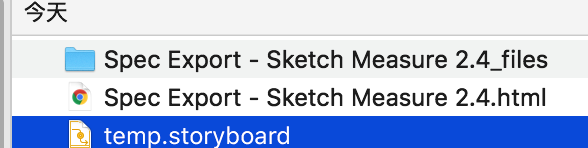
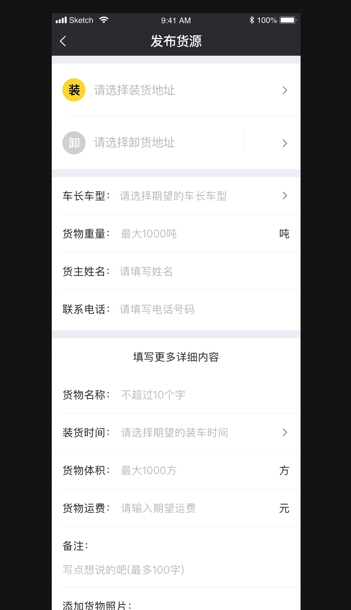
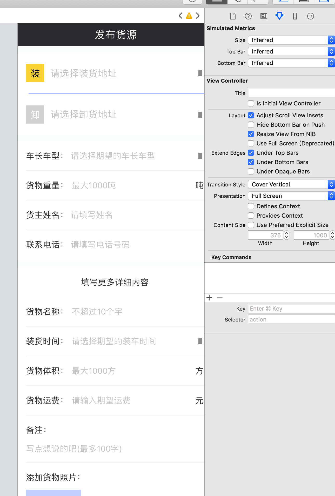

# SketchHtmlToiOSIB
## 如何使用
1.把美工给的Sketch的网页存至本地，当然有时美工给的就是压缩包，就省去了下载这一步

2.运行本程序

3.把1中存的网页的html拖入程序面板

4.生成 temp.storyboard 至桌面

最终如图

## 转换成你的storyboard

这个东西有啥用 ？

0、你喜欢手码，那可以闭关当前网页了。

1、对于死界面有用

2、对于那些麻烦的控件字号、颜色可适当提高效率，不用你自己一个一个拖，一个一个调属性

3、对于一些cell，也可以直接将生成的一些控件，拖入，加上约束就可以了。

***
问题
提取页面所有控件问题多，或者只提取label是不是更实用此呢
***
转换文件来源
- [x] 本地文件
- [ ] 网络url,存储到本地
***
输出格式
- [x] sb格式
- [ ] xib格式
- [ ] 手码格式
***
sb功能列表
- [x] 读取页面个数，生成对应个数的控制器
- [ ] 载入图片资源
***
vc功能列表
- [x] 根据title生成控制器sb中的label
- [x] 加入view、label、imageView控件
- [ ] 使用原生nav，导航栏，未移除，所有子控件y上移调整
- [ ] 加入scrollView控件
- [ ] 自动识别控件重叠，转换为button控件
- [ ] 自动识别控件复用，转换为table控件
- [ ] 大控件遮住了小控件，调整控件层级功能
- [ ] 最后个子控件超出屏幕后，设置vc的simulated size 为freeform，并更新height
***
label功能列表
- [x] rect
- [x] bg alpha
- [x] text
- [x] textColor
- [x] fontSize
- [x] 识别 苹方-简 常规体  PingFangSC-Regular
- [x] 识别 苹方-简 中黑体  PingFangSC-Medium
- [x] 识别 苹方-简 中粗体  PingFangSC-Semibold
- [x] 识别 Helvetica
- [x] 识别 DINAlternate-Bold
- [ ] 宽高自适应，目前有挤压现象，暂处理为给宽度增加额外长度。
***
view功能列表
- [x] rect
- [x] bgColor
- [x] bg alpha
- [ ] 嵌套子控件（目前Sketch全是平级，没有嵌套子控件）
***
imageView功能列表
- [x] rect
- [x] bg alpha

