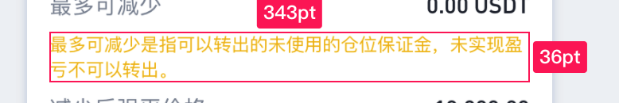
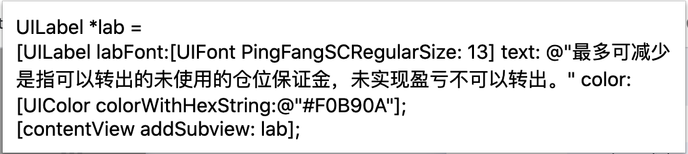
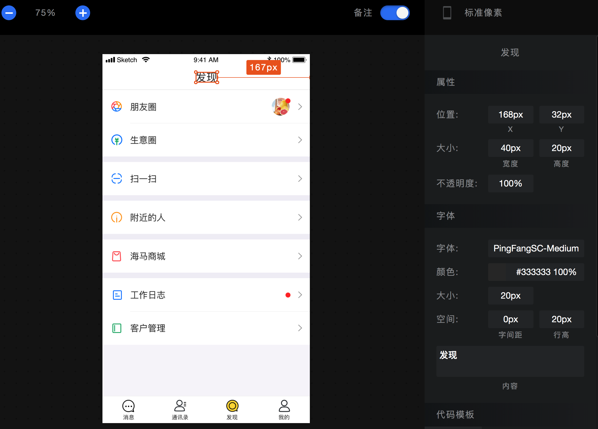
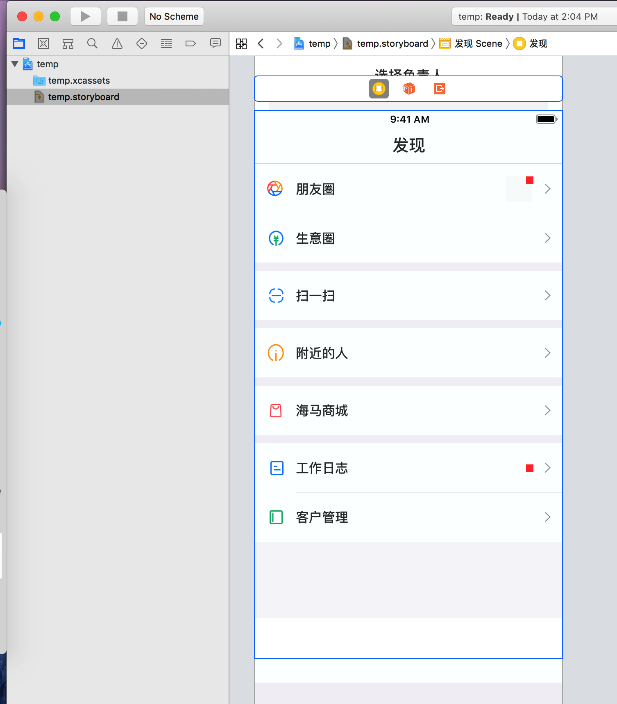
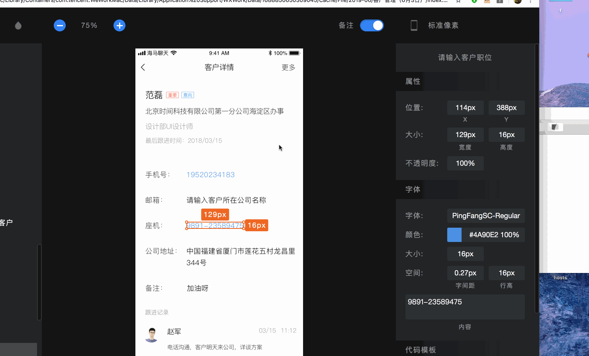

# SketchHtmlToiOSIB
## 原理
SketchHtml源码中能找到所有页面及页面内部的控件及其布局信息JSON串，解析生成对应xml控件。

而有的公司可能是使用兵蓝湖，而其网页源码中没有相关信息，只有在点中某个文字图片之后才有相关的面板信息在网页内，此时只能取得单控件的信息，针对这种情况只能使用谷歌插件进行自定义处理了。
<!-- 
 -->

## 新增功能记录

1、增加子控件嵌套功能：view支持一级、二级嵌套

2、增加按钮识别功能：支持一级按钮、二级按钮合成

3、载入图片功能

4、支持输入框控件

5、修复一些特殊蒙板透明度问题

6、新增识别字体类型（PingFangHK-Regular、PingFangSC-Light、PingFangHK-Medium、STHeitiSC-Light）

## 如何使用
1.把美工给的Sketch的网页存至本地，当然有时美工给的就是压缩包，就省去了下载这一步

2.运行本程序

3.把1中存的网页的html拖入程序面板

4.生成 temp.xcodeproj 至桌面
<!-- 

 -->

## 转换成你的storyboard

1、对于那些麻烦的控件字号、颜色可适当提高效率，不用你自己一个一个拖，一个一个调属性

2、对于一些cell，也可以直接将生成的一些控件，拖入，加上约束就可以了。

***
转换文件来源
- [x] 本地文件
- [ ] 网络url,存储到本地

***
输出格式
- [x] sb格式
- [ ] xib格式
- [ ] 手码格式

***
sb功能列表
- [x] 读取页面个数，生成对应个数的控制器
- [ ] 载入图片资源

***
vc功能列表
- [x] 根据title生成控制器sb中的label
- [x] 加入view、label、imageView控件
- [ ] 使用原生nav，导航栏，未移除，所有子控件y上移调整
- [ ] 加入scrollView控件
- [x] 自动识别控件重叠，转换为button控件
- [ ] 自动识别控件复用，转换为table控件
- [ ] 大控件遮住了小控件，调整控件层级功能
- [x] 最后个子控件超出屏幕后，设置vc的simulated size 为freeform，并更新height

***
button功能列表(目前只能识别根view下的button)
- [x] 背景颜色
- [x] 字样式及大小
- [x] normal状态下的文字及文字颜色

***
label功能列表
- [x] text
- [x] textColor
- [x] fontSize
- [x] 识别 苹方-简 常规体  PingFangSC-Regular
- [x] 识别 苹方-简 中黑体  PingFangSC-Medium
- [x] 识别 苹方-简 中粗体  PingFangSC-Semibold
- [x] 识别 Helvetica
- [x] 识别 DINAlternate-Bold
- [ ] 宽高自适应，目前有挤压现象，暂处理为给宽度增加额外长度。

***
view功能列表
- [x] rect
- [x] bgColor
- [x] bg alpha
- [x] 根view的直接子view, 加入子控件
- [x] 根view的直接子view的子view，加入子控件

***
imageView功能列表
- [x] rect
- [x] 载入图片

***
textField功能列表
- [x] rect
- [x] placeholder文字
- [x] 字号，字体
- [x] 先把问题简单化，placeholder文字颜色、输入后显示文字的颜色内部写死

